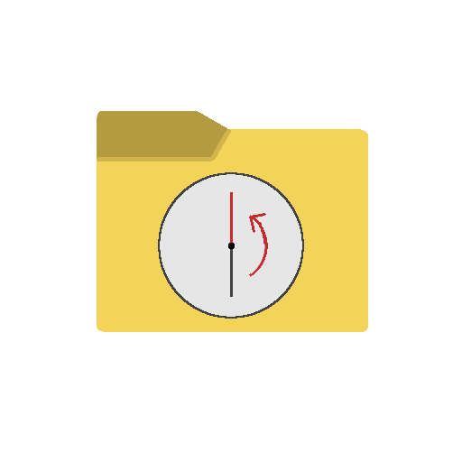

# ファイルタイムマシン / File Time Machine

<p align="center">
  
</p>

<p align="center">
  <strong>直感的にファイル履歴を確認・復元できるGUIツール / A Visual Git GUI for Everyone</strong>
</p>

<p align="center">
  <a href="#日本語">日本語</a> | <a href="#english">English</a>
</p>

---

## 日本語

### 開発の背景
ファイルの履歴管理や、変更された箇所の確認は、日常的な作業において重要なニーズです。しかし、それを実現するための一般的なバージョン管理システム（Gitなど）はコマンドラインでの操作が主流であり、コマンドの知識を持たないユーザーにとっては導入のハードルが高いという課題がありました。

本アプリは、専門知識がないPCユーザーでも、直感的な操作でファイルの履歴管理（過去の状態への復元や変更点の確認）を行えるようにすることを目指して開発されました。

---

### アプリの仕組みについて
本アプリは、裏側でバージョン管理システム「Git」を呼び出すことで動作するGUI（グラフィカル・ユーザー・インターフェース）ツールです。

ユーザーが画面上で行った操作（フォルダの指定や履歴の選択、復元など）を、アプリが自動的にGitコマンドに変換して実行します。これにより、コマンドの直接入力に伴う誤操作のリスクを抑えつつ、安全にファイルの履歴管理を行うことができます。

---

### 主な機能
本アプリで利用可能な機能の一覧です。

* **履歴のタイムライン表示**
  - ファイルの変更履歴をグラフとして視覚的に表示します。いつ変更が行われたのかをひと目で確認できます。
* **ファイル変更箇所の比較 (Diff)**
  - 過去の時点のファイルと現在のファイルを並べ、変更された行（追加・削除）を色分けして視覚的に比較できます。
* **ファイルの復元**
  - 履歴の中から特定の時点を選択し、その時点のファイル状態にワンクリックで復元できます。
* **安全対策**
  - 不正なパス指定や意図しないコマンド実行を防ぐため、実行前に厳格なパス検証とコマンド引数の安全検証を実施しています。
* **16言語対応のローカライズ**
  - 日本語や英語をはじめとした16種類の言語に対応しており、環境に合わせて表示言語を選択できます。

---

### インストール方法

Windows、macOS、Linuxで動作します。

1. **ダウンロード**
   - 本リポジトリの **Releases** ページから、ご利用のOSに対応したインストーラーをダウンロードします。
     - **Windows**: `.msi` または `.exe` ファイル
     - **macOS**: `.dmg` ファイル
2. **インストール**
   - ダウンロードしたファイルを実行し、画面の指示に従ってインストールを行ってください。

---

### 基本的な使い方

1. **フォルダの指定**
   - アプリを起動後、変更履歴を記録・管理したいファイルが保存されているフォルダを選択します。
2. **履歴の確認**
   - ファイルに変更が加わると自動的に履歴が記録されます。タイムライン上の各ノードをクリックすると、その時点の変更内容や差分を確認できます。
3. **過去の状態への復元**
   - 復元したい時点を選択し、「復元」ボタンを押すことで、指定した時点のファイル状態に戻すことができます。

---

### 開発者向け情報

本プロジェクトをご自身でビルド・開発する方向けの情報です。

#### 技術スタック
- **デスクトップフレームワーク**: Tauri v2
- **フロントエンド**: React (TypeScript), Vite
- **バックエンド / システム制御**: Rust
- **多言語対応**: i18next (16言語対応)

#### セットアップとビルド手順
1. リポジトリをクローンします。
2. `app-file-timemachine` ディレクトリに移動し、必要なパッケージをインストールします。
   ```bash
   cd app-file-timemachine
   npm install
   ```
3. 開発用サーバーを起動してアプリを実行します。
   ```bash
   npm run tauri dev
   ```
4. リリース用のインストーラーをビルドします。
   ```bash
   npm run tauri build
   ```

---

## English

### Background
Managing file history and identifying modifications are essential requirements in daily computing tasks. However, mainstream version control systems (such as Git) primarily rely on command-line interfaces, creating a high barrier to entry for users without specialized command-line experience.

This application was developed to allow any user to manage file history—including checking modifications and reverting files to prior states—using intuitive graphical controls, without requiring technical command-line knowledge.

---

### How the App Works
This application functions as a Graphical User Interface (GUI) wrapper that calls the "Git" version control system in the background.

When you interact with the interface (such as selecting a folder, reviewing history, or reverting a file), the application automatically translates these actions into the appropriate Git commands. This approach minimizes the risk of accidental command-line errors and ensures safe, consistent file history management.

---

### Key Features
A list of features available in this application:

* **Visual History Timeline**
  - Displays file modification history visually as a timeline graph, making it easy to identify when changes occurred.
* **Side-by-Side Diff Viewer**
  - Displays historical and current versions of a file side-by-side, color-coding added and deleted lines for clear comparison.
* **One-Click File Restore**
  - Allows you to select any point in the history timeline and restore files to that exact state with a single click.
* **Security & Safety Measures**
  - Actively performs path normalization and strict command argument validation in the background to prevent unauthorized directory access or unintended command execution.
* **16-Language Localization**
  - Fully translated into 16 languages, letting you operate the interface in your preferred language setting.

---

### Installation

Compatible with Windows, macOS, and Linux.

1. **Download**
   - Go to the **Releases** page of this repository and download the appropriate installer for your operating system:
     - **Windows**: `.msi` or `.exe` file
     - **macOS**: `.dmg` file
2. **Install**
   - Run the downloaded installer file and follow the on-screen instructions.

---

### Basic Usage

1. **Select a Folder**
   - Launch the application and select the folder containing the files you wish to track.
2. **Review History**
   - The application automatically records a new point in history when files are modified. Click on any timeline node to view file contents and modifications at that moment.
3. **Restore Prior Version**
   - Select the historical point you wish to revert to, and click the "Restore" button to revert your files to that state.

---

### For Developers

Information for developers wishing to build or customize this project.

#### Tech Stack
- **Desktop Framework**: Tauri v2
- **Frontend**: React (TypeScript), Vite
- **Backend / Core Control**: Rust
- **Localization**: i18next (16-language support)

#### Setup and Build Instructions
1. Clone the repository.
2. Navigate to the `app-file-timemachine` folder and install dependencies:
   ```bash
   cd app-file-timemachine
   npm install
   ```
3. Launch the application in development mode:
   ```bash
   npm run tauri dev
   ```
4. Build the release installers:
   ```bash
   npm run tauri build
   ```
