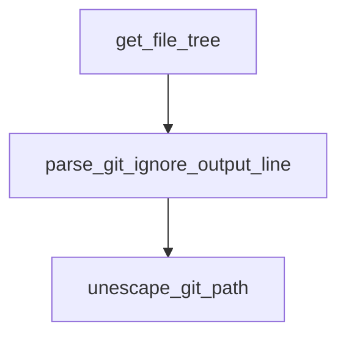

# files.rs 仕様書

ファイルシステムとGitの無視リストを探索し、ツリー構造のデータを構築するモジュール。

## 関数定義

### `parse_git_ignore_output_line` (L11-19)
- **型**: `fn parse_git_ignore_output_line(line: &str) -> String`
- **説明**: `git check-ignore` の出力行（オクタルエスケープ形式など）をパースし、通常のパス文字列に変換する。

### `unescape_git_path` (L22-42)
- **型**: `fn unescape_git_path(s: &str) -> String`
- **説明**: Gitのオクタルエスケープシーケンス（`\NNN` 形式）をUTF-8文字列に変換する。

### `get_file_tree` (L54-244)
- **型**: `#[tauri::command] pub async fn get_file_tree(root_path: String) -> Result<Vec<FileEntry>, String>`
- **説明**: 指定されたルートパスの配下のファイルツリーを探索し、Gitの無視ファイル判定を含めて `FileEntry` のリストとして返却する。
  - ※デッドロック回避のため、非同期 (`async fn`) に変更。

### `get_file_info` (L256-310)
- **型**: `#[tauri::command] pub fn get_file_info(path: String) -> Result<FileInfo, String>`
- **説明**: ファイルのメタデータ（サイズ、最終更新日時、ファイル形式、MIMEタイプ）を取得する。

## 依存関係 (Mermaid)

## 影響範囲
- フロントエンドの `FileTree.tsx` から呼び出される。
- `get_file_tree` は非同期IO化（`tokio::process::Command`）の影響を受ける。