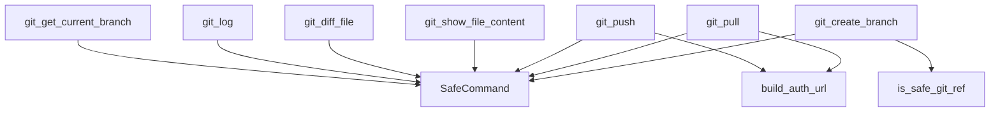

# git.rs 仕様書

Gitリポジトリ操作（初期化、ログ取得、コミット、ブランチ管理、差分取得、リモート同期など）を提供するコマンド群。

## 関数定義

### 共通ヘルパー関数
- `is_safe_git_ref(name: &str) -> bool`: ブランチ名などのGit参照名が安全かチェックする。
- `build_auth_url(remote_url: &str, token: &str) -> Result<String, String>`: 認証トークンを含む一時的なURLを構築する。

### Tauriコマンド群（すべて `async fn`）
- `git_init(path: String) -> Result<String, String>`: リポジトリ初期化。
- `git_commit(path: String, message: String) -> Result<String, String>`: コミット作成。
- `git_log(path: String) -> Result<Vec<CommitLog>, String>`: コミットログ（履歴）取得。
- `git_get_current_branch(path: String) -> Result<String, String>`: カレントブランチ名取得。
- `git_create_branch(path: String, branch_name: String) -> Result<String, String>`: 新規ブランチ作成・チェックアウト。
- `git_get_branches(path: String) -> Result<Vec<String>, String>`: ブランチ一覧取得。
- `git_checkout(path: String, branch: String) -> Result<String, String>`: ブランチのチェックアウト。
- `git_diff_file(path: String) -> Result<String, String>`: ファイルの最新（HEAD）との差分取得。
- `git_merge_to_main(path: String, branch: String) -> Result<String, String>`: 指定ブランチを本番（main）にマージ。
- `git_get_conflicts(path: String) -> Result<Vec<String>, String>`: 競合しているファイル一覧取得。
- `git_resolve_conflict(path: String, file: String, resolution: String) -> Result<String, String>`: 競合の解消。
- `git_merge_abort(path: String, original_branch: String) -> Result<String, String>`: マージの中止と復帰。
- `git_show_file_content(path: String, commit_hash: String, file_path: String) -> Result<FilePreviewContent, String>`: 過去のコミット時点のファイル内容を取得。
- `git_diff_file_commit(path: String, commit_hash: String, file_path: String) -> Result<String, String>`: 過去コミットと親コミットとの特定ファイルの差分取得。
- `git_delete_branch(path: String, branch_name: String) -> Result<String, String>`: ブランチの削除。
- `git_rename_branch(path: String, old_name: String, new_name: String) -> Result<String, String>`: ブランチの名称変更。
- `git_get_remote(path: String) -> Result<Option<String>, String>`: リモートURLの取得。
- `git_set_remote(path: String, remote_url: String) -> Result<(), String>`: リモートURLの設定。
- `git_push(path: String, token: String, branch: String) -> Result<String, String>`: リモートへプッシュ。
- `git_pull(path: String, token: String, branch: String) -> Result<String, String>`: リモートからプル。
- `git_get_uncommitted_files(path: String) -> Result<Vec<UncommittedFileInfo>, String>`: 未コミットの変更ファイル一覧。
- `update_gitignore(...) -> Result<(), String>`: `.gitignore` に対するパターンの追加・削除。
- `switch_git_mode(...) -> Result<(), String>`: ホワイトリスト/ブラックリストの切り替えと `.gitignore` の再構築。

## 依存関係 (Mermaid)

## 影響範囲
- `MainLayout.tsx`, `GitGraph.tsx`, `HistoryList.tsx`, `FilePreview.tsx` などのほぼ全ての主要フロントエンドコンポーネントがこれらのコマンドを呼び出す。
- デッドロック・非同期スレッドハング防止のため、すべてのコマンドで `tokio::process::Command` を使用した非同期的コマンド実行へと移行する。
