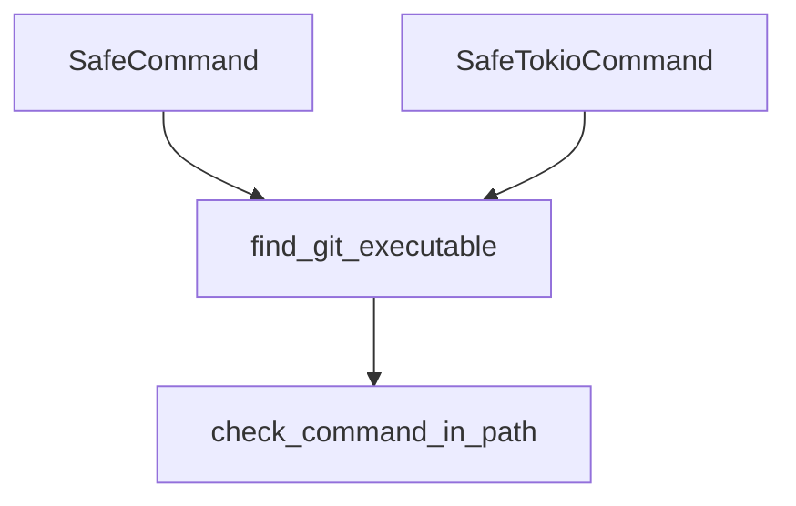

# lib.rs 仕様書

Tauri アプリケーションのエントリーポイントおよび共通ラッパー型（Command）の定義。

## 定義されている変数・構造体・関数

### `SafeCommand`
- **型**: `pub struct SafeCommand;`
- **説明**: `std::process::Command` を生成するラッパー構造体。Windows環境においてコンソールウィンドウ（黒い画面）がポップアップするのを防ぐフラグ (`CREATE_NO_WINDOW`) を自動設定する。
  - **フォールバック検出**: 実行対象が `git` である場合、 `find_git_executable` を呼び出して解決されたパスを起動する。

### `SafeTokioCommand`
- **型**: `pub struct SafeTokioCommand;`
- **説明**: `tokio::process::Command` を生成するラッパー構造体。Windows環境における `CREATE_NO_WINDOW` フラグの設定および、 `git` に対する `find_git_executable` のフォールバックパス適用を非同期コマンドに対して自動で行う。

### `find_git_executable` (L6-60)
- **型**: `pub fn find_git_executable() -> String`
- **説明**: Gitコマンドの実行ファイルを安全に取得する。
  1. `git --version` が `PATH` 環境変数経由で動作するか確認する。
  2. 動作しない場合、OSごとの標準インストールパス（Windows: `Program Files/Git` 等、macOS: `/usr/bin/git`, `/opt/homebrew/bin/git` 等）を直接探索して、見つかったパスを返す。

### `run` (L131-185)
- **型**: `pub fn run()`
- **説明**: Tauri アプリケーションのビルドと起動を実行する。

## 依存関係 (Mermaid)

## 影響範囲
- バックエンドのすべてのコマンドファイル（`files.rs`, `git.rs`, `setup.rs` など）がこのラッパーを経由してコマンドを実行する。