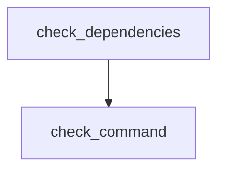

# setup.rs 仕様書

アプリ起動時の依存関係チェック（Git、GitHub CLI of 有無）と、自動インストールのロジックを提供するモジュール。

## 関数定義

### `check_dependencies` (L22-33)
- **型**: `#[tauri::command] pub async fn check_dependencies(simulate: Option<bool>) -> Result<DependencyStatus, String>`
- **説明**: 起動時に `git` や `gh` などの必要なコマンドが存在するか確認し、その結果を返す。
  - ※環境変数 `PATH` に見つからない場合に、OSごとの標準インストールパスを直接探索するフォールバック処理を追加。

### `check_command` (L35-40)
- **型**: `fn check_command(cmd: &str, args: &[&str]) -> bool`
- **説明**: 指定したコマンドを引数付きで実行し、成功ステータスが返るかをチェックする。

### `install_dependency` (L43-158)
- **型**: `#[tauri::command] pub async fn install_dependency(app: AppHandle, tool: String, simulate: bool) -> Result<(), String>`
- **説明**: 指定された依存関係（`git`, `gh`）のインストールプロセスを呼び出し、進捗ログをフロントエンドにブロードキャスト（emit）する。

## 依存関係 (Mermaid)

## 影響範囲
- アプリ起動時の `Wizard.tsx`（初回起動セットアップ画面）から呼び出される。
- Gitの標準パス探索ロジックを追加することで、インストール直後のPATH未反映状態でもGitを正しく認識できるようにする。